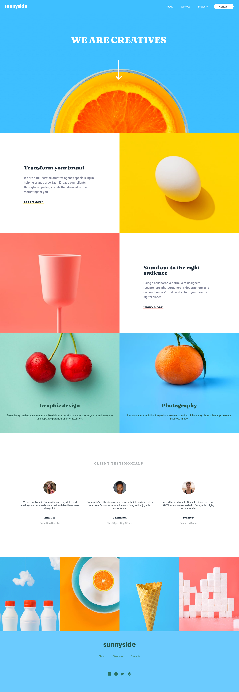
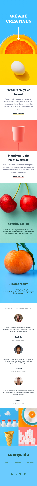

# Frontend Mentor - Sunnyside agency landing page solution

This is a solution to the [Sunnyside agency landing page challenge on Frontend Mentor](https://www.frontendmentor.io/challenges/sunnyside-agency-landing-page-7yVs3B6ef). Frontend Mentor challenges help you improve your coding skills by building realistic projects.

## Table of contents

- [Overview]
  - [The challenge]
  - [Screenshot]
  - [Links]
- [My process]
  - [Built with]
  - [What I learned]
  - [Continued development]
  - [Useful resources]
- [Author]


## Overview

### The challenge

Users should be able to:

- View the optimal layout for the site depending on their device's screen size
- See hover states for all interactive elements on the page

### Screenshot




### Links

- Solution URL: [https://github.com/SakonBel/sunnyside-landing-page-FEM]
- Live Site URL: [https://sakonbel.github.io/sunnyside-landing-page-FEM/]

## My process

### Built with

- Semantic HTML5 markup
- CSS custom properties
- Flexbox
- JavaScript
- Mobile-first workflow

### What I learned

Use this section to recap over some of your major learnings while working through this project. Writing these out and providing code samples of areas you want to highlight is a great way to reinforce your own knowledge.

To see how you can add code snippets, see below:

#### HTML

##### Using "picture" for art direction
```
<picture>
  <source
    media="(max-width: 950px)"
    srcset="images/mobile/image-header.jpg"
  />
  <source
    media="(min-width: 951px)"
    srcset="images/desktop/image-header.jpg"
  />
  
</picture>
```
This is giving me how to make use of picture for the art direction solution for the first time with real project. Reinforce my understanding on how to use different angle position for different viewport

##### Using "srcset" for different size image
```

```

##### Using "svg" tag
```
<svg>

</svg>
```
This give me the knowledge of how to use svg tag on the page to make styling easier for svg file.

Again, this give me more knowledge on how to use different image with different width and height size. Not only good for design on different viewport, but also save user bandwidth for not have to upload the image file that is larger than necessary.

##### Using "figure", "figcaption" and "blockquote"
```
<figure>
    
    <blockquote>
      <p>
        Incredible end result! Our sales increased over 400% when we
        worked with Sunnyside. Highly recommended!
      </p>
    </blockquote>
    <figcaption>
      <span class="person">Jennie F.</span><br />Business Owner
    </figcaption>
</figure>
```
This let me structure my code in a more semantic way for the quote, along with how to link the quote with the involving caption and image.

#### CSS

##### Hover effect
```
.nav-contact {
  background: var(--yellow);
  width: 35%;
  margin: 5px auto;
  padding: 15px;
  border-radius: 50px;
  transition: 0.5s;
}

```
This make me know how to make use of many CSS properties that include in case to make use of hover effect. This properties include transition, origin, even scaling and other stuffs. I will be sure to have fun with all these properties on my upcoming project.

#### JavaScript

##### Hiding navbar effect
```
// fucntion for toggle navbar
function toggleMenu(active, zone) {
  navMenu.classList.toggle("nav-active");
  hamburger.classList.toggle("ham-active");
  navItem.classList.toggle("nav-item-active");
  status.active = !active;
  clearTimeout(vanish);
}

// function for making navbar disappear when not clicked
function slideNav() {
  clearTimeout(vanish);
  vanish = setTimeout(() => {
    nav.style.top = "-100px";
  }, 2000);
}

// function for making navbar disappear when scroll
function scrollEffect() {
  let scrollTop = window.pageYOffset;

  if (scrollTop >= 0 && scrollTop < 100) {
    nav.style.top = `-${scrollTop}px`;
    clearTimeout(vanish);
  } else if (scrollTop > scrollEndTop) {
    if (status.active) {
      nav.style.top = "0";
    } else {
      nav.style.top = `-100px`;
    }
  } else {
    if (status.active) {
      clearTimeout(vanish);
      nav.style.top = "0";
    } else {
      nav.style.top = "0";
      slideNav();
    }
  }
  scrollEndTop = scrollTop;
}

// function for hiding navbar transition on changing viewport
function hideNavbarEffect() {
  nav.style.transition = "0s";
  navMenu.style.transition = "0s";
  showNavbarEffect();
}

// function that terminate timeout transition effect
function showNavbarEffect() {
  clearTimeout(navbar);
  navbar = setTimeout(() => {
    nav.style.transition = "0.5s";
    navMenu.style.transition = "0.3s";
  }, 200);
}

```
I'm sure have a lot of fun with JavaScript in this project, and I learn a lot too. I make all these function and tweak it into my own style thanks to the knowledge from other developer on the internet. All these functions do interesting things like toggle navbar, hiding navbar on slide, set time out for the navbar to disappear and even hiding the navbar effect transition on resize.

### Continued development

I have build this landing page successfully, but I think there are many area that I need to improve. Here is the things that I find myself have a hard time with, and some that I don't use but want to learn in the future.

- CSS flexbox
- CSS grid
- Accessibility
- More semantic relate HTML
- Design thinking and Structure

### Useful resources

- [Kevin Powell youtube channel](https://www.youtube.com/channel/UCJZv4d5rbIKd4QHMPkcABCw) - This channel help me learn a lot about CSS on both basic and advance topic. Many thanks to him for the valuable content.

- [Online tutorial youtube channel](https://www.youtube.com/channel/UCbwXnUipZsLfUckBPsC7Jog) - This is also valuable youtube channel about CSS. This channel give me many example on how to make some useful and beautiful components.

- [Stack overflow](https://stackoverflow.com) - This is helping me to find solution for many of my problems. Really a lifesaver site.

## Author

Made by Sakon Plangklang
- Frontend Mentor - [@SakonSabel](https://www.frontendmentor.io/profile/SakonSabel)
- Twitter - [@WhitePhantoms](https://twitter.com/WhitePhantoms)

